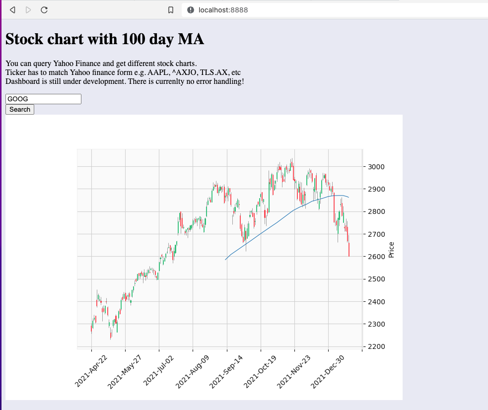

# Dashboard

This program plots stock charts to a localhost webpage using data pulled from Yahoo Finance.
There is a basic seach box that you can use to look up tickers (Yahoo Finance format).
Currently functional but needs development.

#### Whats the point of all this:
One of my trading stratergies requires that I manually observe when the closing price crosses over the 100 day MA. There are some extra features I would like to add eventually so why not make a program? 

## Technologies used:
* Backend is Python - tornado, yfinance, mplfinance
* Frontend is HTML/JavaScript

## What needs to be done:
* Error handling
* Input validation
* CSS - make it pretty!
* Add features - Multiple stock lists, scrolling charts, etc.

## Screenshot:

