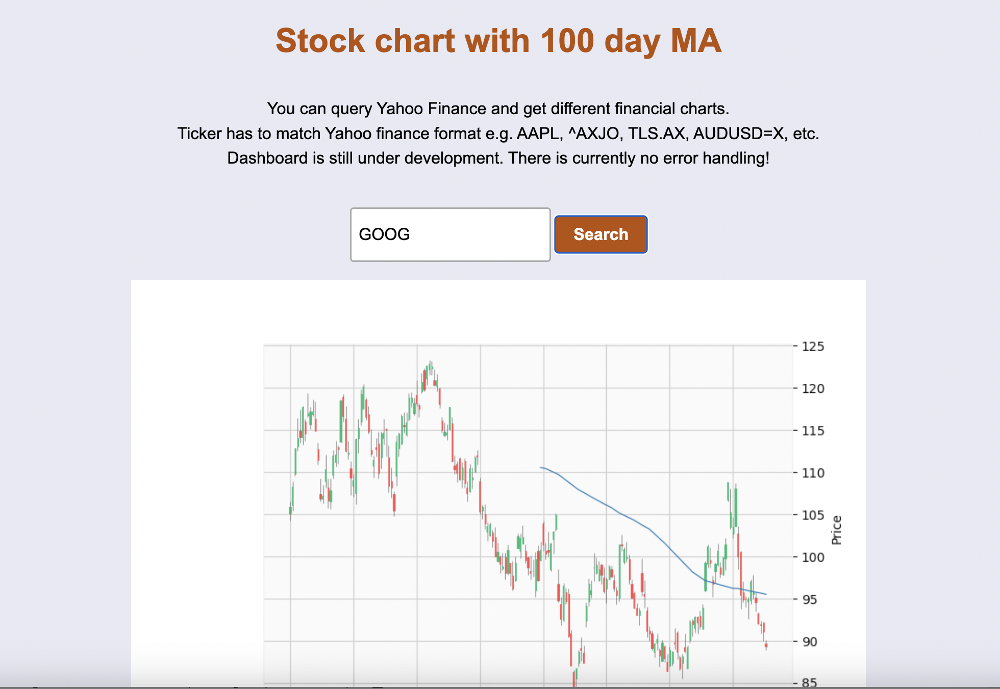

# Dashboard

This program plots stock charts to a localhost webpage using data pulled from Yahoo Finance.
There is a basic seach box that you can use to look up tickers (Yahoo Finance format).
Currently functional but needs development.
Long term plan is to plot the stocks that I own, refreshing daily, and highlight the 100 day MA.

## Technologies used:
* Backend is Python - tornado, yfinance, mplfinance
* Frontend is HTML/JavaScript

## What needs to be done:
* Error handling
* CSS - make it pretty!

## Screenshot:

